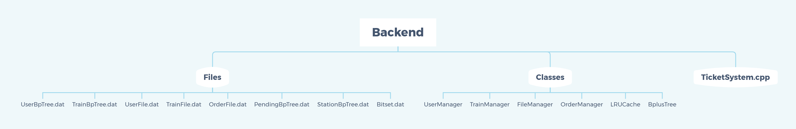
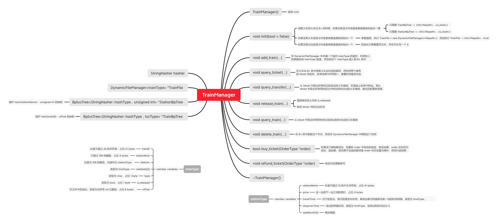
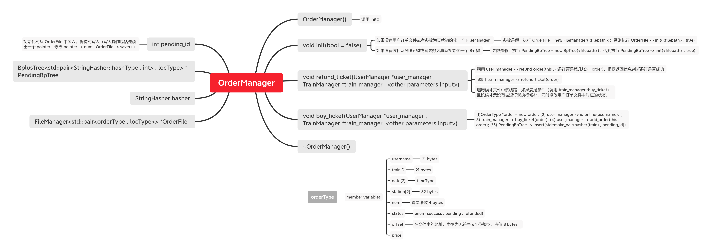
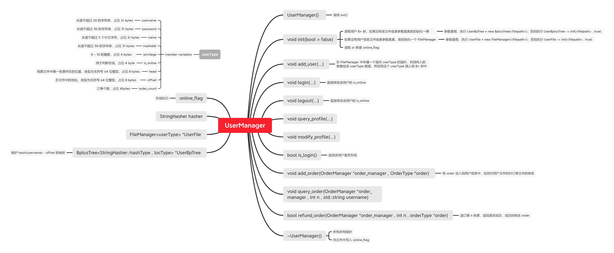
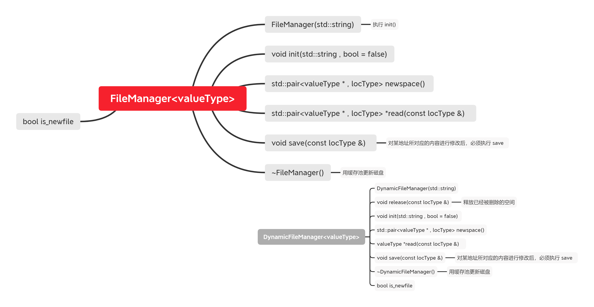
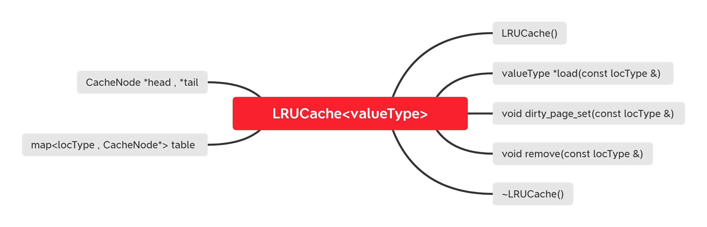
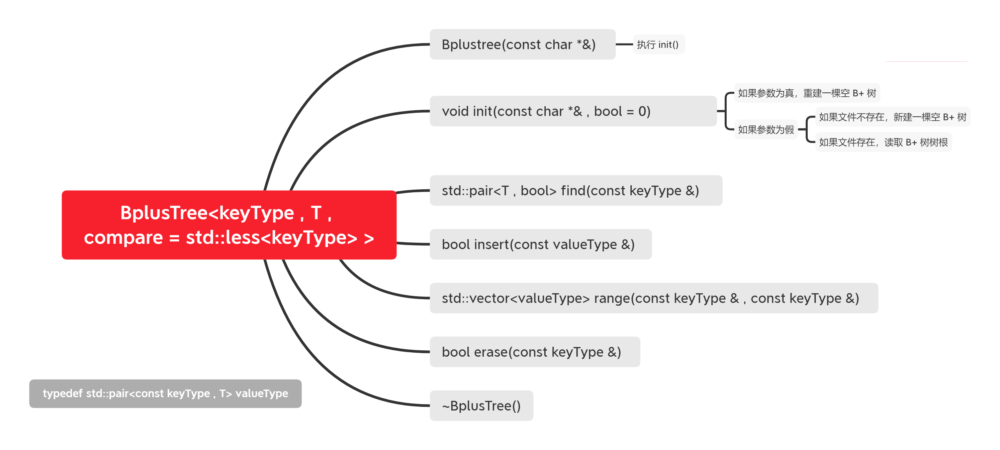

# TicketSystem
## 开发人员
| 组员 | 分工 |
| :---: | :---: |
|蔡子逸 ([@acrazyczy](https://github.com/acrazyczy))|后端缓存，后端逻辑|
|季利恒 ([@jlhsmall](https://github.com/jlhsmall))|后端 B+ 树，前端|
|严含冲 ([@brandon-yan](https://github.com/brandon-yan))|后端逻辑，前端|

## 项目地址
http://175.24.50.237:5000/

别卷了别卷了 QAQ

## 后端架构

